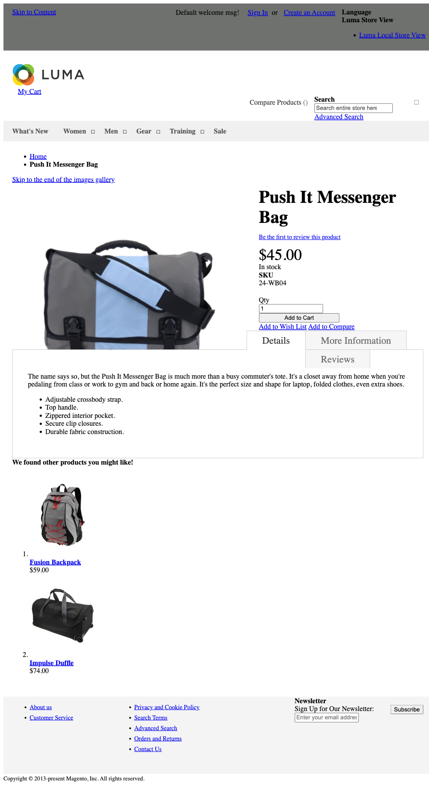
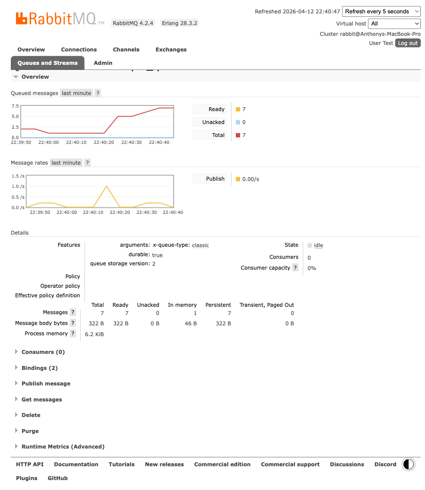

<!--
Author: Anthony Cicchelli
Date: 2026-04-12
-->

# Gist Questions And Results

Source requirement:

- [Magento Assessment Gist](https://gist.github.com/dambrogia/0e19ac3bb78f53fdbcf6f04bf64b7df6)

Public environment under test:

- Storefront: [https://luma.anthonycicchelli.com/](https://luma.anthonycicchelli.com/)
- RabbitMQ: [https://luma.anthonycicchelli.com/rabbitmq/](https://luma.anthonycicchelli.com/rabbitmq/)
- Queue page: [https://luma.anthonycicchelli.com/rabbitmq/#/queues/anthonycicchelli/assessment.simple_queue](https://luma.anthonycicchelli.com/rabbitmq/#/queues/anthonycicchelli/assessment.simple_queue)
- Public PDP used for verification: [https://luma.anthonycicchelli.com/catalog/product/view/id/14/s/push-it-messenger-bag/](https://luma.anthonycicchelli.com/catalog/product/view/id/14/s/push-it-messenger-bag/)

## Public Review Checklist

1. Storefront loads  
Link: [https://luma.anthonycicchelli.com/](https://luma.anthonycicchelli.com/)  
Result: `HTTP 200` on the public anthony Luma host.  
Status: PASS

2. RabbitMQ is reachable publicly  
Link: [https://luma.anthonycicchelli.com/rabbitmq/](https://luma.anthonycicchelli.com/rabbitmq/)  
Queue page: [https://luma.anthonycicchelli.com/rabbitmq/#/queues/anthonycicchelli/assessment.simple_queue](https://luma.anthonycicchelli.com/rabbitmq/#/queues/anthonycicchelli/assessment.simple_queue)  
Login: `Test / Test123`  
Result: the public RabbitMQ UI loads on the anthony host and the `assessment.simple_queue` queue is inspectable.  
Status: PASS

3. REST entry point works  
Link: [https://luma.anthonycicchelli.com/rest/V1/simple-queue/publish](https://luma.anthonycicchelli.com/rest/V1/simple-queue/publish)  
Result: `POST` returns `HTTP 200` with body `OK`. Broker-side queue depth moved from `19` to `21` during the public verification run.  
Status: PASS

4. CLI entry point works  
Command:
```bash
cd /Users/acicchelli/Code/anthonycicchelli-magento
/opt/homebrew/Cellar/php@8.3/8.3.30/bin/php -d memory_limit=2G bin/magento simple-queue:publish
```
Result: command returns `OK`. Broker-side queue depth moved from `18` to `19` during the verification run.  
Status: PASS

5. Product detail page entry point works  
Link: [https://luma.anthonycicchelli.com/catalog/product/view/id/14/s/push-it-messenger-bag/](https://luma.anthonycicchelli.com/catalog/product/view/id/14/s/push-it-messenger-bag/)  
Cache-buster example: [https://luma.anthonycicchelli.com/catalog/product/view/id/14/s/push-it-messenger-bag/?tc=doc-pass-check-2](https://luma.anthonycicchelli.com/catalog/product/view/id/14/s/push-it-messenger-bag/?tc=doc-pass-check-2)  
Result: the public PDP returns `HTTP 200` and the broker-side queue depth moved from `19` to `21` during the public verification run.  
Status: PASS

6. Consumer log format matches the requirement  
Log file: `/Users/acicchelli/Code/anthonycicchelli-magento/var/log/consumer.log`  
Expected format: `Message published at [publish_time] and consumed at [consumed_time]`  
Result: the anthony consumer writes the required line format to `var/log/consumer.log`.  
Status: PASS

7. Overall gist outcome on the public anthony host  
Result: the public Luma host, RabbitMQ UI, CLI entry point, REST entry point, PDP entry point, and consumer log all passed the current review run.  
Status: PASS

## Public Proof Images

### Public Product Detail Page



### Public RabbitMQ Queue


