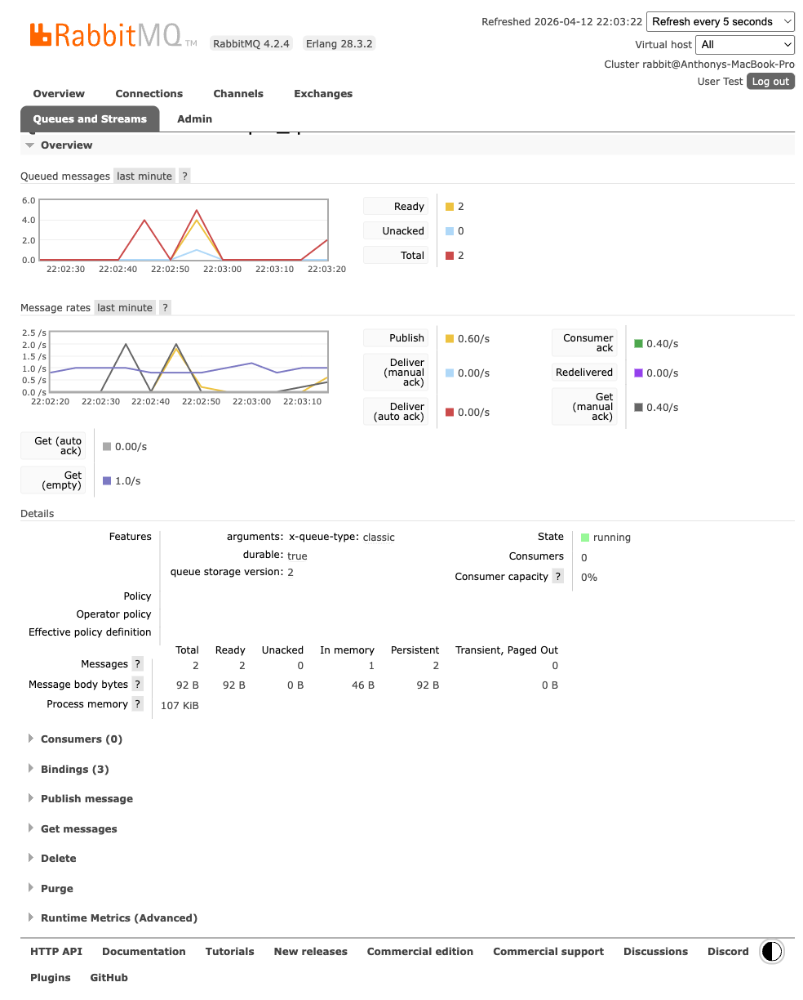

<!--
Author: Anthony Cicchelli
Date: 2026-04-12
-->

# Gist Questions And Results

Source requirement:

- [Magento Assessment Gist](https://gist.github.com/dambrogia/0e19ac3bb78f53fdbcf6f04bf64b7df6)

Public environment under test:

- Storefront: [https://luma.anthonycicchelli.com/](https://luma.anthonycicchelli.com/)
- RabbitMQ: [https://luma.anthonycicchelli.com/rabbitmq/](https://luma.anthonycicchelli.com/rabbitmq/)
- Queue page: [https://luma.anthonycicchelli.com/rabbitmq/#/queues/anthonycicchelli/assessment.simple_queue](https://luma.anthonycicchelli.com/rabbitmq/#/queues/anthonycicchelli/assessment.simple_queue)

## Questions And Results

| Question | Result | Status |
| --- | --- | --- |
| Is `Assessment_SimpleQueue` enabled? | Magento reports `Assessment_SimpleQueue : Module is enabled`. | PASS |
| Does the CLI command exist? | Magento lists `simple-queue:publish`. | PASS |
| Does the CLI command return `OK`? | `bin/magento simple-queue:publish` returned `OK`. | PASS |
| Does the REST endpoint return `200 OK` with body `OK`? | `POST /rest/V1/simple-queue/publish` returned `HTTP 200` and body `OK`. | PASS |
| Does RabbitMQ work publicly on `luma.anthonycicchelli.com`? | The public RabbitMQ UI loads, login works, and the queue is visible on the anthony vhost. | PASS |
| Do CLI and REST publish into `assessment.simple_queue`? | Broker-side queue counts increased immediately after both CLI and REST tests. | PASS |
| Does the consumer log the required format to `var/log/consumer.log`? | A fresh consume run added a new line with `Message published at ... and consumed at ...`. | PASS |
| Does the public product detail page publish to the same queue? | The public PDP loads successfully, but repeated public tests did not produce a retained queue message. | FAIL |
| Does the public environment fully satisfy the original gist end to end? | Everything except the public PDP observer path is passing. | PARTIAL |

## Public RabbitMQ Proof

